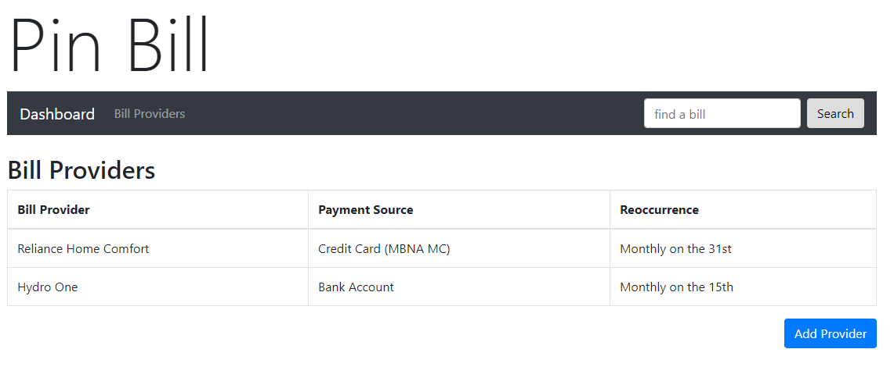

# Pinbill

A web-based bill organization app with the ability to "pin" bills to your calendar.

## Features
* login with Google
* maintain a list of bill providers
* add a new bill for a bill provider
    * leverage Google Calendar API to add automatically add a calendar event
* mark a bill as paid
* view bill history

## Design

Initial implementation is a web-based solution built with Angular 7 and running on Node 10.

### Tech stack
* angular 7.x
* node 10.14.2
* bootstrap 4.x
* firebase 5.x
* firebase-tools 6.2 (installed globally)

## Developing 

### Development server

Run `npm start` to start a dev server. Navigate to `http://localhost:4200/`. The app will automatically reload if you change any of the source files.

### Build

Run `npm run build` to build the project. The build artifacts will be stored in the `dist/` directory. 

Run `npm run build:prod` to create a production build.

### Testing and linting

Run `npm run test` to execute the unit tests via [Karma](https://karma-runner.github.io).

Run `npm run e2e` to execute the end-to-end tests via [Protractor](http://www.protractortest.org/).

Run `npm run lint` to run linting process.

### Firebase

Firebase Tools CLI v6.2 installed globally on development machine